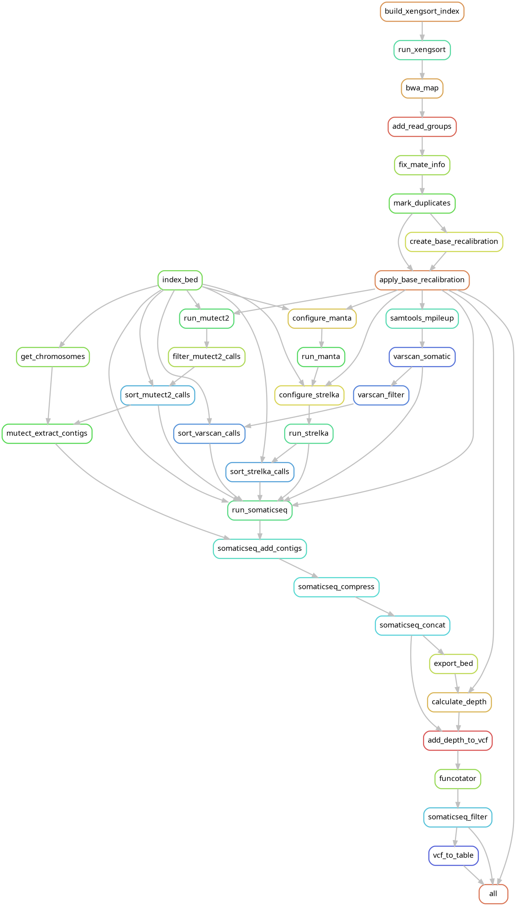

# WES-snakemake: Somatic Variant Calling Pipeline

A Snakemake-based pipeline for calling somatic variants in tumor-normal pairs, with support for Patient-Derived Xenograft (PDX) samples.

## Installation and Dependencies

### Required Software

* **Conda/Miniconda** (version 24.11.3 or higher)
* **Snakemake** (version 8.29.3 or higher)
* **Docker** (version 27.3.1 or higher)

### Docker Images

The pipeline requires the following Docker images:

* **broadinstitute/gatk:4.6.1.0**: For GATK tools
* **mcfonsecalab/strelka:2.9.10**: For Strelka2 variant caller
* **lethalfang/somaticseq:latest**: For SomaticSeq variant consensus

These can be installed by these commands:
```bash
docker pull broadinstitute/gatk:4.6.1.0
docker pull mcfonsecalab/strelka:2.9.10
docker pull lethalfang/somaticseq:latest
```

Ensure Docker is configured to allow the current user to run containers.

### Reference Data

The pipeline requires several reference files specified in `config.yaml`:

Resources which can be downloaded from the GATK resource buckets:
* Human reference genome hg38 in fasta format (`Homo_sapiens_assembly38.fasta`)
* Known sites for base recalibration - can be downloaded from [gatk resource bucket](https://console.cloud.google.com/storage/browser/gcp-public-data--broad-references/hg38/v0), files `Homo_sapiens_assembly38.dbsnp138.vcf`, `Homo_sapiens_assembly38.known_indels.vcf.gz` and `Mills_and_1000G_gold_standard.indels.hg38.vcf.gz`
* Germline resource for Mutect2 - `af-only-gnomad.hg38.vcf.gz`
* Funcotator data sources - [`funcotator_dataSources.v1.8.hg38.20230908s`](https://console.cloud.google.com/storage/browser/broad-public-datasets/funcotator/funcotator_dataSources.v1.8.hg38.20230908s)
* Host reference genome in fasta format for PDX samples (mm39)

Provided together with the exome library preparation kit:
* Exome capture regions in BED format 

## Running the Pipeline

### Sample Table Preparation

Create an Excel file named `input.xlsx` with the following columns:

* **run**: Run identifier grouping samples from the same experiment
* **samplename**: Unique sample identifier
* **Type**: Sample type - "CTRL" for normal samples, "PDX" for xenograft samples, any other value for tumor samples
* **fq1**: Full path to R1 FASTQ file
* **fq2**: Full path to R2 FASTQ file

Example format:

| run | samplename | type | fq1 | fq2 |
|-----|------------|------|-----|-----|
| Run1 | Normal01 | CTRL | /path/to/Normal01_R1.fastq.gz | /path/to/Normal01_R2.fastq.gz |
| Run1 | Tumor01 | Tumor | /path/to/Tumor01_R1.fastq.gz | /path/to/Tumor01_R2.fastq.gz |
| Run1 | PDX01 | PDX | /path/to/PDX01_R1.fastq.gz | /path/to/PDX01_R2.fastq.gz |

**Important notes:**
* Each run must have exactly one sample designated as "CTRL" (normal)
* Tumor and PDX samples will be compared against the normal sample from the same run
* For PDX samples, mouse reads will be filtered out automatically

### Configuration

Modify `config.yaml` to specify:

* Paths to reference files
* Computational resources (threads, memory)
* Tool-specific parameters
* Docker image versions

### Launching the Pipeline

To start the pipeline with default settings:

```bash
./run.sh
```

This runs Snakemake in the background with 32 cores by default. 

To run with different core count either edit the `run.sh` file or run Snakemake directly:

```bash
snakemake --use-conda --cores <NUMBER_OF_CORES>
```

To stop a running pipeline:

```bash
./stop.sh
```

## Outputs

### Directory Structure

The pipeline produces the following output directories:

* **bam/**: Contains processed BAM files
* **results/**: Contains final VCF and Excel files
* **metrics/**: Contains QC metrics and logs
* **vcf/**: Contains intermediate VCF files

### VCF Output

For each tumor sample, the pipeline produces a consensus VCF file:

```
results/<run>/<sample>/<sample>.snv_indels.vcf
```

This VCF file contains somatic variants that passed filtering criteria and represents the consensus calls from multiple variant callers (Mutect2, VarScan2, Strelka2).

### Excel Table Output

For each tumor sample, an Excel spreadsheet is also produced:

```
results/<run>/<sample>/<sample>.snv_indels.xlsx
```

The Excel file contains the following columns:

* **Position_hg38**: Chromosome and position in hg38 reference
* **Variant**: Variant description (reference > alternate alleles)
* **FILTER**: Empty column for additional manual filtering records
* **VAF_NORMAL/TUMOR**: Variant allele frequency in normal/tumor
* **GT_NORMAL/TUMOR**: Genotype in normal/tumor
* **DP_NORMAL/TUMOR**: Read depth in normal/tumor
* **Gencode_* fields**: Gene annotations from GENCODE including:
  * Gene symbol
  * Variant classification
  * Variant type
  * Transcript information
  * Protein change
* **HGNC_* fields**: Gene information from HGNC database including:
  * Gene ID
  * Approved gene name
  * Alias symbols/names
  * NCBI Gene ID
  * Ensembl IDs
  * Pubmed IDs
  * RefSeq IDs
  * Enzyme IDs
  * UniProt ID
  * Gene group information

## Pipeline Workflow

The pipeline performs the following steps:

1. PDX sample filtering (for xenograft samples)
3. Read mapping with BWA-MEM
4. Read group addition
5. Duplicate marking
6. Base quality recalibration
7. Somatic variant calling with:
   * Mutect2
   * VarScan2
   * Manta/Strelka2
8. Variant consensus with SomaticSeq
9. Depth calculation
10. Variant annotation with Funcotator
11. Final filtering and output generation

Rule graph:




## Troubleshooting

### Common Issues

* **Docker permission errors**: Ensure your user is in the docker group with `sudo usermod -aG docker $USER`
* **Missing reference files**: Verify all paths in `config.yaml` are correct and accessible
* **Memory issues**: Adjust `java_max_gb` and `java_min_gb` values in the config file if jobs fail due to memory constraints

### Logging

* Pipeline logs are stored in `snakemake.log`
* Tool-specific logs are stored in `logs/` directory
* Metrics for each sample are stored in `metrics/` directory

## Version History

* **v1.0** - Initial release with support for Mutect2, VarScan2, and Strelka2 variant callers and SomaticSeq consensus


## Acknowledgments

This pipeline uses several open-source tools:

#### GATK (Broad Institute)

```
Van der Auwera GA & O'Connor BD. (2020). Genomics in the Cloud: Using Docker, GATK, and WDL in Terra (1st Edition). O'Reilly Media.
```

#### Mutect

```
Cibulskis, K., Lawrence, M., Carter, S. et al. Sensitive detection of somatic point mutations in impure and heterogeneous cancer samples. Nat Biotechnol 31, 213–219 (2013). https://doi.org/10.1038/nbt.2514
```

#### Strelka2 (Illumina)

```
Kim S, Scheffler K, Halpern AL, Bekritsky MA, Noh E, Källberg M, Chen X, Kim Y, Beyter D, Krusche P, Saunders CT. Strelka2: fast and accurate calling of germline and somatic variants. Nat Methods. 2018 Aug;15(8):591-594. doi: 10.1038/s41592-018-0051-x. Epub 2018 Jul 16. PMID: 30013048.
```

#### VarScan2 (Washington University)

```
Koboldt DC, Zhang Q, Larson DE, Shen D, McLellan MD, Lin L, Miller CA, Mardis ER, Ding L, Wilson RK. VarScan 2: somatic mutation and copy number alteration discovery in cancer by exome sequencing. Genome Res. 2012 Mar;22(3):568-76. doi: 10.1101/gr.129684.111. Epub 2012 Feb 2. PMID: 22300766; PMCID: PMC3290792.
```

#### SomaticSeq (Roche)

```
Fang LT, Afshar PT, Chhibber A, Mohiyuddin M, Fan Y, Mu JC, Gibeling G, Barr S, Bani Asadi N, Gerstein MB, et al. An ensemble approach to accurately detect somatic mutations using SomaticSeq. Genome Biology. 2015;16(1):197. doi:10.1186/s13059-015-0758-2
```

#### Xengsort (TU Dortmund University)

```
Zentgraf, J., Rahmann, S. Fast lightweight accurate xenograft sorting. Algorithms Mol Biol 16, 2 (2021). https://doi.org/10.1186/s13015-021-00181-w
```

#### Snakemake (Köster et al.)

```
Mölder, F., Jablonski, K.P., Letcher, B., Hall, M.B., Tomkins-Tinch, C.H., Sochat, V., Forster, J., Lee, S., Twardziok, S.O., Kanitz, A., Wilm, A., Holtgrewe, M., Rahmann, S., Nahnsen, S., Köster, J., 2021. Sustainable data analysis with Snakemake. F1000Res 10, 33.
```
