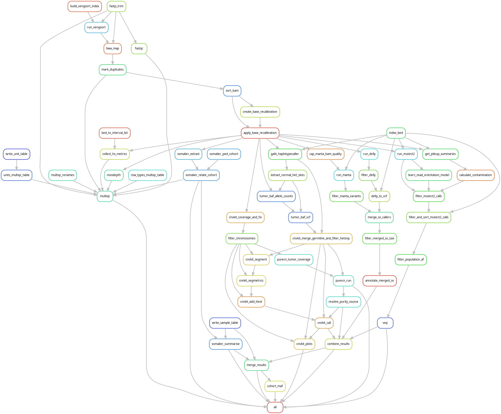

# WES-snakemake: Somatic Variant Calling Pipeline

A Snakemake-based pipeline for calling somatic short nucleotide variants (SNV/Indel), copy number variants (CNV), and structural variants (SV) in tumor samples. Supports tumor–normal paired mode and tumor-only mode (with Panel of Normals), as well as Patient-Derived Xenograft (PDX) samples.

## Installation and Dependencies

Use your python environment manager (conda, etc.) to install the environment from `environment.yml`. E.g., for micromamba:

```bash
micromamba env create -f environment.yml
```

Then activate the `snakemake-wes` environment.

### Configuration

Modify `config.yaml` to specify:

* Paths to reference files
* Per-kit probe configurations (BED files, CNVkit references)
* Computational resources (threads, memory)
* Tumor-only settings (Panel of Normals paths, population AF threshold)

### Reference files

Resources which can be downloaded from the [GATK resource bucket](https://console.cloud.google.com/storage/browser/gcp-public-data--broad-references/hg38/v0):
* Human reference genome hg38 in fasta format (`Homo_sapiens_assembly38.fasta`)
* Known sites for base recalibration: `Homo_sapiens_assembly38.dbsnp138.vcf`, `Homo_sapiens_assembly38.known_indels.vcf.gz`, and `Mills_and_1000G_gold_standard.indels.hg38.vcf.gz`
* Germline resource for Mutect2: `af-only-gnomad.hg38.vcf.gz`
* Funcotator data sources: [`funcotator_dataSources.v1.8.hg38.20230908s`](https://console.cloud.google.com/storage/browser/broad-public-datasets/funcotator/funcotator_dataSources.v1.8.hg38.20230908s)

#### Enabling gnomAD exome/genome annotations in Funcotator

By default, gnomAD_exome and gnomAD_genome are disabled in the Funcotator data sources. To enable them:

1. Extract the tarballs in the data sources directory:
   ```bash
   cd <funcotator_dataSources_dir>
   tar xzf gnomAD_exome.tar.gz
   tar xzf gnomAD_genome.tar.gz
   ```

2. **Fix the GCS bucket path** — the default config points to a requester-pays bucket
   that errors with `"Bucket is a requester pays bucket but no user project provided."`.
   Edit `gnomAD_exome/hg38/gnomAD_exome.config` and `gnomAD_genome/hg38/gnomAD_genome.config`:
   ```
   # Change:
   src_file=gs://broad-public-datasets
   # To:
   src_file=gs://gcp-public-data--broad-references
   ```
   Ref: [GATK releases — Funcotator Data Location Moved](https://github.com/broadinstitute/gatk/releases)

* Host reference genome in fasta format for PDX samples (mm39)

Other resources:
* Exome capture regions in BED format — provided by the exome library preparation kit manufacturer.
* AnnotSV annotations — can be downloaded using the [INSTALL_annotations shell script](https://github.com/lgmgeo/AnnotSV/blob/master/bin/INSTALL_annotations.sh).
* PureCN SNP blacklist (`refs.purecn.snp_blacklist`) — UCSC Simple Repeats (Tandem Repeats Finder) track for hg38, passed to `PureCN.R --snp-blacklist` to exclude repeat-region variants from purity/ploidy fitting:
  ```bash
  wget -O simpleRepeat.txt.gz https://hgdownload.soe.ucsc.edu/goldenPath/hg38/database/simpleRepeat.txt.gz
  zcat simpleRepeat.txt.gz | cut -f2-4 > hg38_simpleRepeats.bed   # chrom, chromStart, chromEnd (already 0-based)
  ```
  Stored at `/mnt/data/NGS/refs/UCSC/hg38_simpleRepeats.bed`, alongside `refFlat.txt` (same source, same directory).

## Running the Pipeline

### Samplesheet Preparation

Create comma-separated table `samplesheet.csv` with columns:

* **ID**: Sample group identifier (usually a patient ID). Samples sharing an ID are processed together.
* **sample**: Sample identifier, unique within the given ID.
* **sample_type**: Sample type — `CTRL` for matched normal/germline, `PDX` for xenograft, any other value is treated as a tumor sample.
* **gender**: `f` for female, `m` for male.
* **probes**: Exome library kit version. Must match a key in `probe_configs` in `config.yaml`.
* **purity**: Known or estimated tumor cell fraction (0–1). Used for CNVkit copy number calling and CCF calculation.
* **fq1**: Full path to R1 FASTQ file.
* **fq2**: Full path to R2 FASTQ file.

Example format:

| ID   | sample   | sample_type | gender | probes | purity | fq1 | fq2 |
|------|----------|-------------|--------|--------|--------|-----|-----|
| Pt01 | Normal01 | CTRL        | m      | V8+UTR | 0      | /path/to/Normal01_R1.fastq.gz | /path/to/Normal01_R2.fastq.gz |
| Pt01 | Tumor01  | Tumor       | m      | V8+UTR | 0.7    | /path/to/Tumor01_R1.fastq.gz  | /path/to/Tumor01_R2.fastq.gz  |
| Pt01 | Tumor02  | Tumor       | m      | V8+UTR | 0.3    | /path/to/Tumor02_R1.fastq.gz  | /path/to/Tumor02_R2.fastq.gz  |
| Pt01 | Model01  | PDX         | m      | V8+UTR | 1      | /path/to/Model01_R1.fastq.gz  | /path/to/Model01_R2.fastq.gz  |

#### Tumor–Normal Paired Mode

Each run group (same `ID`) with a `CTRL` sample is processed in paired mode. All tumor/PDX samples in the group are compared against the single normal.

#### Tumor-Only Mode

Run groups **without** a `CTRL` sample are processed in tumor-only mode. In this mode:

- Mutect2 uses a Panel of Normals (PON) for artifact filtering instead of a matched normal.
- A population allele frequency filter is applied after PASS filtering to remove common germline variants (configurable threshold, default AF > 0.001 against gnomAD).
- CNVkit B-allele frequency (BAF) analysis and HaplotypeCaller germline calling are skipped.
- Manta runs in tumor-only mode.

A PON must be configured in `config.yaml` for each probe version used in tumor-only runs:

```yaml
tumor_only:
  pon:
    "V8+UTR": "/path/to/pon_SureSelectV8UTR.vcf.gz"
  af_threshold: 0.001
```

The pipeline validates at startup that all tumor-only samples have a PON configured.

### Launching the Pipeline

Before launching, check the profile config in `profiles/default/config.yaml`. The workflow requires both conda and singularity.

**For containers to work you must bind the reference directory.** All required reference files should reside under a single directory. Edit the `singularity-args` parameter in the profile config:

```yaml
singularity-args: "-B /path/to/refs:/path/to/refs"
```

Use `snakemake --profile profiles/default -n` to test the pipeline (dry run).

Use `launch.sh` to launch snakemake in detached/background mode, or run in the foreground with `snakemake --profile profiles/default`.

`launch.sh` records the process ID; use `stop.sh` to stop execution.

## Pipeline Steps

DAG rulegraph of the pipeline generated using

```bash
snakemake --rulegraph --profile profiles/default | dot -Tpng -o rulegraph.png
```



### 1. Quality Control and Trimming

**fastp** trims adapter sequences and performs quality filtering on raw FASTQ reads. Per-sample HTML/JSON reports are collected into the MultiQC report.

### 2. Host Read Filtering (PDX samples only)

**xengsort** classifies reads from PDX samples against both the human (hg38) and mouse (mm39) genomes. Only reads classified as "graft" (human origin) proceed to alignment. A xengsort index is built automatically from both reference genomes on first run.

### 3. Read Alignment and BAM Preprocessing

All GATK steps use the official GATK Docker container (`broadinstitute/gatk:4.6.1.0`).

- **BWA MEM**: Paired-end reads aligned to hg38.
- **GATK AddOrReplaceReadGroups**: Read group tags (instrument, flowcell, library prep) are parsed from FASTQ headers.
- **GATK FixMateInformation**: Mate pair information corrected, BAM sorted by coordinate.
- **GATK MarkDuplicates**: PCR duplicates flagged; duplication metrics saved to `results/metrics/`.
- **GATK BaseRecalibrator + ApplyBQSR**: Base quality score recalibration using dbSNP and known indel sites.

### 4. Quality Metrics

- **mosdepth**: Per-region depth of coverage calculated against the exome capture BED file.
- **FastQC**: Post-alignment BAM quality report.
- **MultiQC**: Aggregated QC report from fastp, FastQC, mosdepth, duplicate metrics, and BQSR tables (`results/qc/multiqc_report.html`).

### 5. SNV/Indel Calling

- **GATK Mutect2**: Somatic variant calling restricted to exome capture regions.
  - *Paired mode*: Uses tumor + matched normal BAMs with the gnomAD germline resource.
  - *Tumor-only mode*: Uses PON + gnomAD germline resource; no matched normal BAM.
- **GATK FilterMutectCalls**: Applies Mutect2's statistical filtering model.
- **bcftools**: PASS variants are extracted and coordinate-sorted.
- **Population AF filter** *(tumor-only only)*: Variants annotated with gnomAD AF above the configured threshold (`tumor_only.af_threshold`) are removed.
- **GATK Funcotator**: Functional annotation against Gencode, COSMIC, ClinVar, gnomAD (exome + genome), dbSNP, HGNC, and additional databases. All annotation columns are preserved in the output.

### 6. Copy Number Variant Calling

**CNVkit** (`etal/cnvkit:0.9.11` Docker container):

- Coverage calculated at target and antitarget regions; corrected against sex-specific flat reference baselines.
- CNR filtered to standard chromosomes (1–22, X, Y, M).
- *Paired mode*: GATK HaplotypeCaller generates germline VCFs for both normal and tumor; heterozygous SNPs in the normal are used for BAF-informed CBS segmentation.
- *Tumor-only mode*: Segmentation runs without BAF input (empty VCF placeholder).
- Segmentation confidence intervals computed with bootstrapping (`cnvkit segmetrics`).
- Optional CI-based segment filtering (set `params.cnvkit.filter_ci: true` in `config.yaml`).
- t-test statistics added to segments.
- Copy number calling with purity correction (`cnvkit call`, clonal model, median centering).
- Scatter plot (PNG) and chromosome diagram (PDF) generated per sample.

### 7. Structural Variant Calling

- **Manta**: SV detection restricted to the exome capture regions.
  - *Paired mode*: Outputs somatic SVs (`somaticSV.vcf.gz`).
  - *Tumor-only mode*: Outputs tumor SVs (`tumorSV.vcf.gz`). Both are renamed to a consistent `sv_output.vcf.gz` internally.
- **bcftools**: PASS variants extracted and sorted.
- **AnnotSV**: Structural variant annotation using the GRCh38 annotation database. If no variants pass filtering, an empty output file is created.

### 8. Results Integration

An R script (`combine_results.R`) merges all results into a single Excel workbook per tumor sample.

**Output: `{sample}_results.xlsx`** — three sheets:

| Sheet | Contents |
|-------|----------|
| **SNVs** | Funcotator-annotated PASS SNVs/Indels with per-sample AF, GT, DP, AD; copy number context (total CN, major/minor allele CN from CNVkit); and calculated Cancer Cell Fraction (CCF) |
| **CNVs** | CNVkit segment-level copy number calls |
| **SVs** | AnnotSV-annotated structural variants |

**CCF Calculation**: Cancer Cell Fraction estimates what fraction of cancer cells carry the mutation:

```
CCF = (AF × tumor_CN) / (purity × expected_mutant_copies)
```

Where `expected_mutant_copies` is `tumor_CN` for homozygous (1/1) calls and 1 for heterozygous calls. CCF is capped at 1.0. Normal CN defaults are applied for variants outside CNVkit segments (diploid for autosomes; haploid for chrX/chrY in males).

## Outputs

All final outputs are written to `results/`:

| Path | Description |
|------|-------------|
| `results/qc/multiqc_report.html` | Aggregated QC report (fastp, FastQC, mosdepth, duplicates, BQSR) |
| `results/{run}/{sample}/{sample}_results.xlsx` | Combined SNV/CNV/SV Excel report |
| `results/{run}/{sample}/{sample}.SNV.vcf` | Funcotator-annotated SNV/Indel VCF |
| `results/{run}/{sample}/{sample}.scatter.png` | CNVkit genome-wide scatter plot |
| `results/{run}/{sample}/{sample}.diagram.pdf` | CNVkit per-chromosome copy number diagram |
| `results/metrics/dupl_metrics_{run}_{sample}.txt` | Picard MarkDuplicates metrics |
| `results/metrics/{run}_{sample}.recal_data.table` | BQSR recalibration table |
| `results/metrics/{run}_{sample}.mosdepth.summary.txt` | Coverage summary by region |
| `results/metrics/{run}_{sample}.thresholds.bed.gz` | Coverage threshold BED (10×, 20×, 30×, 50×) |
| `results/metrics/mutect2_filteringStats_{run}_{sample}.tsv` | Mutect2 filter statistics |
| `results/qc/fastp/{run}/{sample}_fastp.html` | Per-sample fastp QC report |
| `results/qc/fastqc/{run}/{sample}_fastqc.html` | Per-sample FastQC report |

Intermediate files are stored under `work/` and temporary files are cleaned up automatically.

## Acknowledgments

This pipeline uses the following open-source tools:

#### GATK (Broad Institute)

```
Van der Auwera GA & O'Connor BD. (2020). Genomics in the Cloud: Using Docker, GATK, and WDL in Terra (1st Edition). O'Reilly Media.
```

#### Mutect2

```
Cibulskis, K., Lawrence, M., Carter, S. et al. Sensitive detection of somatic point mutations in impure and heterogeneous cancer samples. Nat Biotechnol 31, 213–219 (2013). https://doi.org/10.1038/nbt.2514
```

#### CNVkit

```
Talevich E, Shain AH, Botton T, Bastian BC. CNVkit: Genome-Wide Copy Number Detection and Visualization from Targeted DNA Sequencing. PLOS Computational Biology 12(4) (2016). https://doi.org/10.1371/journal.pcbi.1004873
```

#### Manta

```
Chen X et al. Manta: rapid detection of structural variants and indels for germline and cancer sequencing applications. Bioinformatics 32(8):1220–1222 (2016). https://doi.org/10.1093/bioinformatics/btv710
```

#### AnnotSV

```
Geoffroy V et al. AnnotSV: an integrated tool for structural variations annotation. Bioinformatics 34(20):3572–3574 (2018). https://doi.org/10.1093/bioinformatics/bty304
```

#### Xengsort (TU Dortmund University)

```
Zentgraf, J., Rahmann, S. Fast lightweight accurate xenograft sorting. Algorithms Mol Biol 16, 2 (2021). https://doi.org/10.1186/s13015-021-00181-w
```

#### BWA

```
Li H, Durbin R. Fast and accurate short read alignment with Burrows-Wheeler Aligner. Bioinformatics 25(14):1754–1760 (2009). https://doi.org/10.1093/bioinformatics/btp324
```

#### fastp

```
Chen S et al. fastp: an ultra-fast all-in-one FASTQ preprocessor. Bioinformatics 34(17):i884–i890 (2018). https://doi.org/10.1093/bioinformatics/bty560
```

#### mosdepth

```
Pedersen BS, Quinlan AR. Mosdepth: quick coverage calculation for genomes and exomes. Bioinformatics 34(5):867–868 (2018). https://doi.org/10.1093/bioinformatics/btx699
```

#### Snakemake

```
Mölder F, Jablonski KP, Letcher B et al. Sustainable data analysis with Snakemake [version 3; peer review: 2 approved]. F1000Research 2025, 10:33 (https://doi.org/10.12688/f1000research.29032.3)
```
